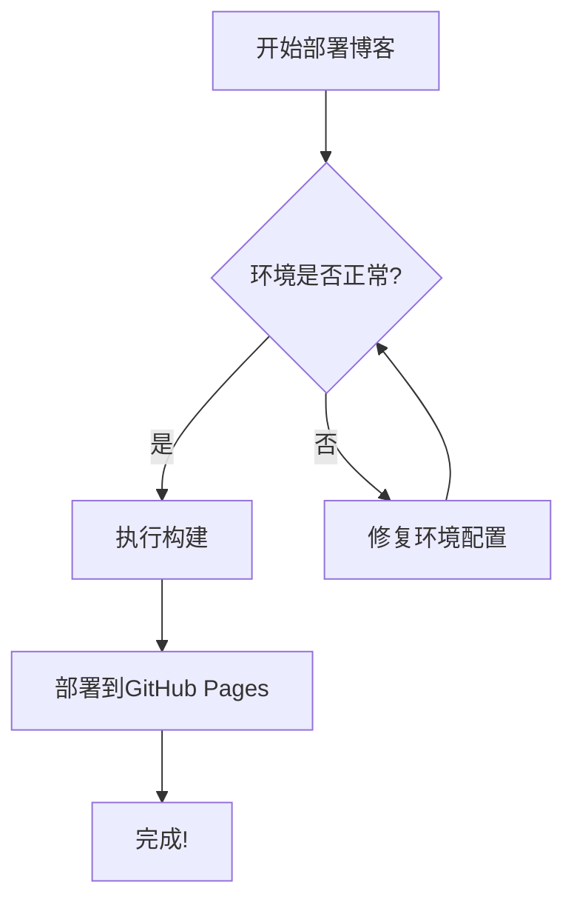
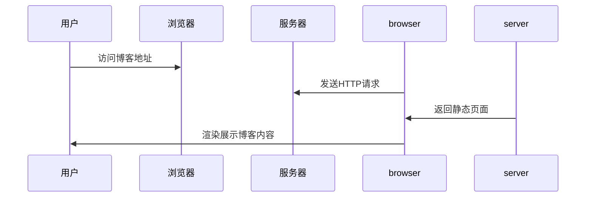

这是一篇用于测试博客所有功能的文章，将覆盖Chirpy主题支持的绝大多数Markdown语法与扩展功能，帮助你一次性验证博客部署是否正常，所有功能是否可以正常渲染。

---

## 标题层级测试
这是二级标题，用于测试文章目录（TOC）的识别
### 三级标题
#### 四级标题
##### 五级标题
###### 六级标题

> 测试说明：你可以查看右侧的文章目录，确认是否能正确识别所有层级的标题。
{: .prompt-tip }

## 文本格式测试
基础文本格式的渲染测试：
- **粗体文本**：测试粗体样式渲染
- *斜体文本*：测试斜体样式渲染
- ~~删除线文本~~：测试删除线样式渲染
- 行内代码：`const test = "hello blog world"`：测试行内代码高亮
- 上标与下标：x^2^，H~2~O
- 表情符号：:smile: :rocket: :coffee: :tada:

## 列表测试
### 无序列表
- 一级列表项1
- 一级列表项2
  - 嵌套二级列表项1
  - 嵌套二级列表项2
    - 嵌套三级列表项
- 一级列表项3

### 有序列表
1. 有序列表第一项
2. 有序列表第二项
   1. 嵌套有序子项1
   2. 嵌套有序子项2
3. 有序列表第三项

### 任务列表
- [x] 已完成的任务项
- [ ] 未完成的任务项
- [x] 带嵌套的已完成任务
  - [x] 子任务1：已完成
  - [ ] 子任务2：未完成

## 引用块测试
> 这是一个普通的引用块，通常用于引用他人的内容，或者单独强调某一段文字。
> 
> 引用块支持多行内容，同时也可以在内部嵌入其他格式，比如**粗体**、`行内代码`，甚至是[链接](https://github.com)。

## 代码块测试
测试不同编程语言的语法高亮，以及主题自带的代码复制按钮、行号显示功能。

### Python 代码示例
```python
def hello_blog():
    """这是一个测试用的Python函数"""
    print("Hello, My Blog!")
    
    # 测试循环与格式化输出
    for i in range(5):
        print(f"Counting: {i + 1}")

if __name__ == "__main__":
    hello_blog()
```

### JavaScript 代码示例
```javascript
// 测试JavaScript语法高亮
function testHighlight() {
    const message = "测试代码高亮功能";
    console.log(message);
    
    // 箭头函数测试
    const add = (a, b) => a + b;
    const result = add(10, 20);
    
    return result;
}
```

### Bash 脚本示例
```bash
# 测试Shell脚本高亮
echo "Hello World from Bash!"
ls -la
git status
bundle exec jekyll serve
```

## 表格测试
测试Markdown表格的渲染，以及不同对齐方式的效果。

| 左对齐内容 | 居中对齐内容 | 右对齐内容 |
| :--------- | :----------: | ---------: |
| 测试数据1  | 测试数据2    | 测试数据3  |
| 长文本测试内容 | 居中展示 | 右对齐测试 |
| `行内代码` | **粗体内容** | *斜体内容* |

## 链接测试
测试不同类型的链接渲染：
- 外部链接：[GitHub 官网](https://github.com)
- 参考式链接：[Bing 搜索][bing-link]

[bing-link]: https://bing.com

## 提示框测试
Chirpy主题自带的四种提示框，用于不同场景的信息展示：

> 这是 Tip 类型的提示，通常用于展示小技巧、小贴士，帮助读者更好的理解内容。
{: .prompt-tip }

> 这是 Info 类型的提示，用于展示普通的通知信息，让读者了解相关的背景内容。
{: .prompt-info }

> 这是 Warning 类型的提示，用于提醒用户需要注意的事项，避免踩坑。
{: .prompt-warning }

> 这是 Danger 类型的提示，用于展示错误信息、危险警告，需要重点关注。
{: .prompt-danger }

## 图片测试
测试图片的加载、懒加载以及响应式适配功能。


*这是一张测试用的示例图片，用于验证图片的懒加载与响应式显示是否正常*

## 数学公式测试
Chirpy主题内置了MathJax支持，可以完美渲染LaTeX数学公式，满足学术、技术写作的需求。

### 行内公式
爱因斯坦的质能方程：$E = mc^2$，这是行内公式的测试，会跟随文本流排列。

### 块级公式
求和公式：
$$
\sum_{i=1}^{n} i = \frac{n(n+1)}{2}
$$

高斯积分公式：
$$
\int_{-\infty}^{\infty} e^{-x^2} dx = \sqrt{\pi}
$$

## Mermaid 图表测试
Chirpy原生支持Mermaid图表，可以直接在Markdown中编写文本格式的图表，自动渲染为矢量图，支持流程图、时序图、类图等多种类型。

### 流程图示例


### 时序图示例


## 折叠块测试
测试可折叠的内容块，用于隐藏较长的辅助内容，保持文章的简洁。

<details>
  <summary>点击这里展开/折叠测试内容</summary>
  <div markdown="1">

  折叠块内部也可以正常渲染所有Markdown格式哦！

  ### 折叠块内的标题
  - 折叠块内的列表项
  - 折叠块内的**格式文本**
  - 甚至可以嵌入代码块：
  ```python
  print("这是写在折叠块里的代码！")
  ```

  </div>
</details>

## 水平线测试
---

## 脚注测试
这是一段带有脚注的文本，用于测试脚注功能[^1]

[^1]: 这是脚注的详细内容，用于对正文内容进行补充说明，不会打断正文的阅读流。

## 视频嵌入测试
Chirpy支持嵌入外部视频，这里以B站视频为例进行测试：



---

## 测试总结
如果你能正常看到以上所有内容的渲染，说明你的博客部署完全正常，所有Chirpy主题的功能都可以正常使用！接下来你就可以开始创作自己的博客文章了。
